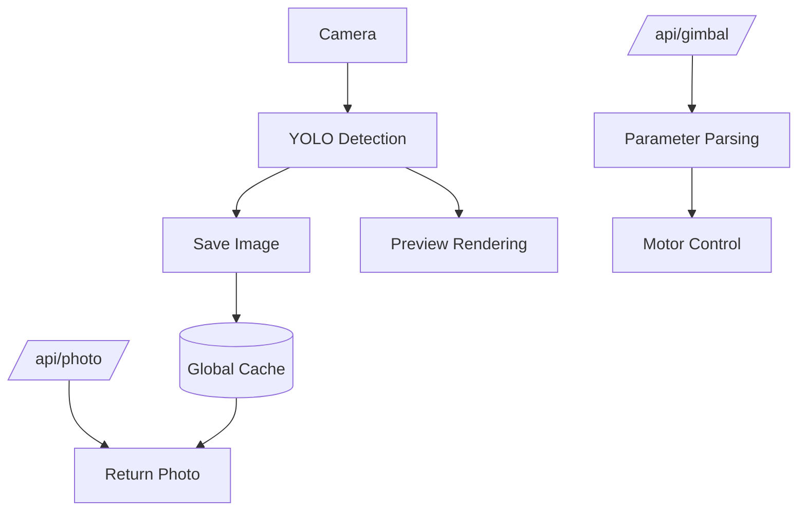

-----

[English] | [简体中文](https://www.google.com/search?q=./README_zh.md)

-----


# reCamera_Gimbal-OpenClaw

> Use OpenClaw to control the motor, camera, LED, microphone, and speaker of a reCamera Gimbal.

## What This Is

This project provides an **OpenClaw Skill + Node-RED flow** for controlling a **reCamera Gimbal edge AI camera**.

It enables:

  * Motor (yaw/pitch) control via HTTP API
  * Image capture and retrieval
  * LED control
  * Audio recording and playback
  * Vision-based interaction via OpenClaw

**Role in OpenClaw:** Skill (with external Node-RED runtime integration)

-----

## Prerequisites

> [\!IMPORTANT]
> You need the following components (derived from project files):

  * A **reCamera Gimbal device** (RISC-V edge AI camera)
  * **Node-RED** running on the device (port `1880`)
  * **OpenClaw** environment with `Exec` tool enabled
  * Network access to the device (local IP like `192.168.31.xxx`)
  * PowerShell (for Windows-based skill scripts)

-----

## Quick Start

### 1\. Import Node-RED Flow

Import the provided file into Node-RED:

```
openclaw_V2.json
```

This creates two HTTP endpoints:

  * Control gimbal: `http://<DEVICE_IP>:1880/api/gimbal?yaw=90&pitch=45`
  * Capture photo: `http://<DEVICE_IP>:1880/api/photo`

-----

### 2\. Install Skill into OpenClaw

Copy the skill folder `recamera-gimbal/` into your OpenClaw workspace:

```bash
~/.openclaw/workspace/skills/recamera-gimbal/
```

-----

### 3\. Configure openclaw.json

The `openclaw.json` file is located in your OpenClaw installation directory. This file contains all the configuration settings for connecting to AI models. You need to add the following configuration for the reCamera Gimbal into `openclaw.json`:

> [\!NOTE]
>
>   * Replace `"C:\\Users\\seeed\\.openclaw\\workspace\\skills"` with the actual path to your skills folder.
>   * Replace `"192.168.31.198"` with the actual IP address of your reCamera Gimbal.
>   * Replace `"recamera.1"` with the actual password of your reCamera Gimbal.

```json
"skills": {
  "load": {
    "extraDirs": [
      "C:\\Users\\seeed\\.openclaw\\workspace\\skills"
    ]
  },
  "entries": {
    "recamera-gimbal": {
      "enabled": true,
      "env": {
        "RECAMERA_IP": "192.168.31.198",
        "RECAMERA_PASS": "recamera.1"
      }
    }
  }
}
```

-----

### 4\. Verify

Test APIs manually:

```bash
# Move gimbal
curl "http://<DEVICE_IP>:1880/api/gimbal?yaw=120&pitch=90"

# Get image
curl "http://<DEVICE_IP>:1880/api/photo"
```

If successful:

  * Gimbal moves
  * Image returns as JPEG

-----

## Configuration

### HTTP API Parameters

From Node-RED flow:

| Field | Type   | Default | Range   |
| ----- | ------ | ------- | ------- |
| yaw   | number | 180     | 1 – 345 |
| pitch | number | 90      | 1 – 175 |

Example:

```http
/api/gimbal?yaw=120&pitch=90
```

-----

### Skill Script Paths

From `SKILL.md`:

```powershell
# LED control
scripts/control_led.ps1 -Action on|off

# Photo capture (via HTTP)
http://<DEVICE_IP>:1880/api/photo
```

-----

## How It Works



### Flow Summary

  * Camera captures frames
  * YOLO model processes detections
  * Latest image stored globally
  * HTTP endpoints expose motor control and image retrieval

-----

## Features

  * **Gimbal Control**: Control yaw and pitch via HTTP API.
  * **Live Image Capture**: Retrieve latest frame as JPEG.
  * **Vision Integration**: YOLO-based object detection pipeline.
  * **LED Control**: Turn light on/off via PowerShell scripts.
  * **Audio I/O**: Record and play audio via scripts.

-----

## Onboarding

From `SKILL.md`:

| Capability     | Trigger                     | Action                           |
| -------------- | --------------------------- | -------------------------------- |
| Vision capture | “look”, “see”, “take photo” | Call `/api/photo`, analyze image |
| Gimbal control | directional commands        | Call `/api/gimbal`                |
| LED control    | “turn on/off light”         | Run PowerShell script            |
| Audio          | “record/play”               | Run script                       |

-----

## Policy

From `SKILL.md`:

| Rule                | Description                                 |
| ------------------- | ------------------------------------------- |
| No file inspection  | Do not read/edit `scripts/`                 |
| Exec only           | Only use predefined commands                |
| Fixed output format | Must return image in strict markdown format |

-----

## Troubleshooting

**Gimbal does not move**

  * Check Node-RED is running on port `1880`
  * Verify device IP
  * Ensure CAN/motor nodes are connected

**No image returned**

  * Ensure model node has debug enabled
  * Check global variable `latest_image` is set

**PowerShell scripts fail**

  * Run with: `  -ExecutionPolicy Bypass `

**HTTP API not reachable**

  * Check firewall/network
  * Confirm Node-RED flow is deployed

-----

## Links

  * OpenClaw Skill Spec: [https://agentskills.io/specification\#allowed-tools-field](https://agentskills.io/specification#allowed-tools-field)

-----
