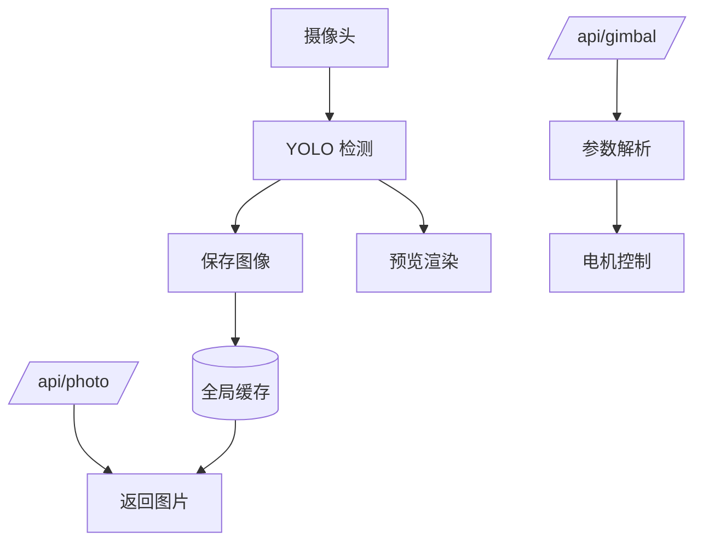

[English](./README.md) | [简体中文]

---


# reCamera_Gimbal-OpenClaw
...


> 使用 OpenClaw 控制 reCamera Gimbal 的电机、摄像头、LED、麦克风和扬声器。

## 项目简介

该项目提供一个 **OpenClaw 技能 + Node-RED 流程**，用于控制 **reCamera Gimbal 边缘 AI 相机**。

支持功能：

* 云台角度控制（Yaw / Pitch）
* 图像采集与获取
* LED 控制
* 音频录制与播放
* 基于视觉的交互能力

**在 OpenClaw 中的角色：** Skill（依赖 Node-RED 运行时）

---

## 环境要求

> [!IMPORTANT]
> 根据项目内容，你需要：

* 一台 **reCamera Gimbal 设备**
* 运行在设备上的 **Node-RED（端口 1880）**
* 已启用 `Exec` 工具的 **OpenClaw 环境**
* 局域网访问（如 `192.168.31.xxx`）
* Windows PowerShell（用于执行脚本）

---

## 快速开始

### 1. 导入 Node-RED 流程

导入文件：

```
openclaw_V2.json
```

将生成两个接口：

* 云台控制：

```
http://<设备IP>:1880/api/gimbal?yaw=90&pitch=45
```

* 获取照片：

```
http://<设备IP>:1880/api/photo
```

---

### 2. 安装 Skill

复制目录：

```
recamera-gimbal/
```

到：

```
~/.openclaw/workspace/skills/recamera-gimbal/
```

---

### 3. 验证

```bash
# 控制云台
curl "http://<设备IP>:1880/api/gimbal?yaw=120&pitch=90"

# 获取图片
curl "http://<设备IP>:1880/api/photo"
```

成功表现：

* 云台转动
* 返回 JPEG 图片

---

## 配置说明

### HTTP 参数

| 参数    | 类型     | 默认值 | 范围      |
| ----- | ------ | --- | ------- |
| yaw   | number | 180 | 1 – 345 |
| pitch | number | 90  | 1 – 175 |

示例：

```
/api/gimbal?yaw=120&pitch=90
```

---

### Skill 脚本

```powershell
# LED 控制
control_led.ps1 -Action on|off

# 获取图片
/api/photo
```

<!-- TODO: 不同系统路径可能不同 -->

---

## 工作原理



---

## 功能特性

* **云台控制**：通过 HTTP 控制角度
* **图像获取**：实时返回 JPEG
* **视觉识别**：YOLO 检测流程
* **LED 控制**：脚本开关灯
* **音频能力**：录音与播放

---

## 使用引导（Onboarding）

| 功能   | 触发方式      | 行为               |
| ---- | --------- | ---------------- |
| 看/识别 | “看看 / 找人” | 调用 `/api/photo`  |
| 控制云台 | 方向指令      | 调用 `/api/gimbal` |
| 开关灯  | 指令        | 执行脚本             |
| 音频   | 录音/播放     | 执行脚本             |

---

## 行为约束（Policy）

| 规则      | 说明            |
| ------- | ------------- |
| 禁止读取脚本  | 不可访问 scripts/ |
| 仅用 Exec | 不允许自造命令       |
| 固定输出格式  | 图片必须按指定格式输出   |

---

## 故障排查

**云台不动**

* 检查 Node-RED 是否运行
* IP 是否正确
* CAN 节点是否连接

**没有图片**

* 确认模型节点开启 debug
* 检查 `latest_image`

**脚本失败**

```powershell
-ExecutionPolicy Bypass
```

**接口不可访问**

* 检查网络/防火墙
* 确认流程已部署

---

## 相关链接

* OpenClaw Skill 规范：[https://agentskills.io/specification#allowed-tools-field](https://agentskills.io/specification#allowed-tools-field)

---

