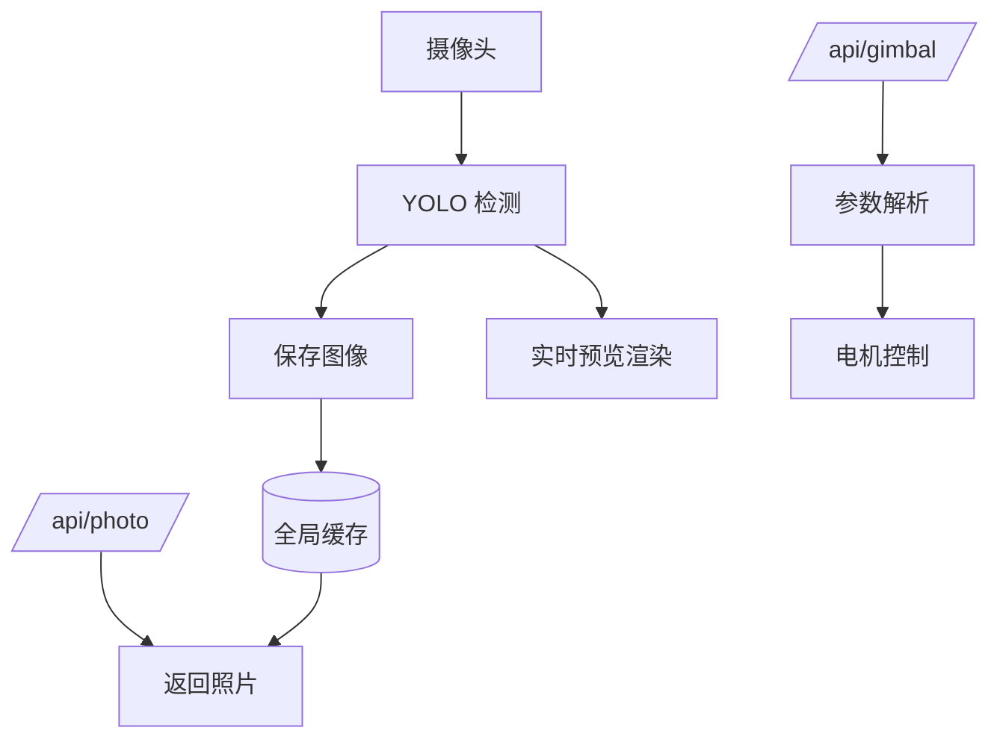

-----

[English   英语](https://github.com/Seeed-Projects/reCamera_Gimbal-OpenClaw/blob/main/README.md) | [简体中文]

-----


# reCamera\_Gimbal-OpenClaw

> 使用 OpenClaw 控制 reCamera Gimbal 的电机、相机、LED、麦克风和扬声器。

## 项目简介

本项目为 **reCamera Gimbal 边缘 AI 相机**提供了一套 **OpenClaw Skill + Node-RED 流程**。

通过该项目，你可以实现：

  * 通过 HTTP API 控制电机（偏航角/俯仰角）
  * 图像抓取与获取
  * LED 灯光控制
  * 音频录制与播放
  * 通过 OpenClaw 进行基于视觉的交互

**在 OpenClaw 中的角色：** Skill（集成外部 Node-RED 运行环境）

-----

## 前提条件

> [\!IMPORTANT]   在[\ !重要的)
> 你需要准备以下组件：

  * **reCamera Gimbal 设备** (RISC-V 边缘 AI 相机)
  * 设备上正在运行的 **Node-RED**（端口 `1880`）
  * 已启用 `Exec` 工具的 **OpenClaw** 环境
  * 设备的网络访问权限（局域网 IP，如 `192.168.31.xxx`）
  * PowerShell（用于运行 Windows 端的 Skill 脚本）

-----

## 快速上手

### 1\. 导入 Node-RED 流程

将以下文件导入到你的 Node-RED 中：

```
openclaw_V2.json
```

这将创建两个 HTTP 接口：

  * **控制云台：** `http://<设备_IP>:1880/api/gimbal?yaw=90&pitch=45`
  * **拍照：** `http://<设备_IP>:1880/api/photo`

-----

### 2\. 将 Skill 安装至 OpenClaw

将 Skill 文件夹 `recamera-gimbal/` 复制到你的 OpenClaw 工作空间：

```bash   ”“bash   “bash”;“bash
~/.openclaw/workspace/skills/recamera-gimbal/~ / .openclaw /工作区/技能/ recamera-gimbal /
```

-----

### 3\. 配置 openclaw.json

`openclaw.json` 文件位于你的 OpenClaw 安装目录下。该文件包含连接 AI 模型的所有配置。你需要将 reCamera Gimbal 的以下配置添加到 `openclaw.json` 中：

> [\!NOTE]
>
>   * 将 `"C:\\Users\\seeed\\.openclaw\\workspace\\skills"` 替换为你技能文件夹的实际路径。
>   * 将 `"192.168.31.198"` 替换为 reCamera Gimbal 的实际 IP 地址。
>   * 将 `"recamera.1"` 替换为 reCamera Gimbal 的实际密码。

```json
"skills": {
  "load": {
    "extraDirs": [
      "C:\\Users\\seeed\\.openclaw\\workspace\\skills"
    ]
  },
  "entries": {
    "recamera-gimbal": {
      "enabled": true,
      "env": {
        "RECAMERA_IP": "192.168.31.198",
        "RECAMERA_PASS": "recamera.1"
      }
    }
  }
}
```

-----

### 4\. 验证

手动测试 API 以确认运行正常：

```bash
# 移动云台
curl "http://<设备_IP>:1880/api/gimbal?yaw=120&pitch=90"

# 获取图像
curl "http://<设备_IP>:1880/api/photo"
```

如果成功：

  * 云台会发生转动
  * 接口返回 JPEG 格式的图像

-----

## 配置说明

### HTTP API 参数

来自 Node-RED 流程：

| 字段 | 类型 | 默认值 | 范围 |
| :--- | :--- | :--- | :--- |
| **yaw** (偏航) | number | 180 | 1 – 345 |
| **pitch** (俯仰) | number | 90 | 1 – 175 |

示例：

```http
/api/gimbal?yaw=120&pitch=90
```

-----

### Skill 脚本路径

摘自 `SKILL.md`：

```powershell
# LED 控制
scripts/control_led.ps1 -Action on|off

# 拍照获取 (通过 HTTP)
http://<设备_IP>:1880/api/photo
```

-----

## 工作原理



### 流程摘要

  * 摄像头捕获帧。
  * YOLO 模型处理检测。
  * 最新图像存储在全局缓存中。
  * HTTP 接口暴露：
      * 电机控制。
      * 图像获取。

-----

## 功能特性

  * **云台控制**：通过 HTTP API 精确控制偏航角和俯仰角。
  * **实时图像捕获**：以 JPEG 格式获取最新的一帧画面。
  * **视觉集成**：内置基于 YOLO 的目标检测流水线。
  * **LED 控制**：通过 PowerShell 脚本远程开关灯光。
  * **音频输入/输出**：通过脚本录制和播放音频。

-----

## 指令引导 (Onboarding)

摘自 `SKILL.md`：

| 能力 | 触发词 (示例) | 执行动作 |
| :--- | :--- | :--- |
| **视觉捕获** | “看”、“观察”、“拍照” | 调用 `/api/photo`，分析图像 |
| **云台控制** | 方向指令（如“向左看”） | 调用 `/api/gimbal` |
| **LED 控制** | “开灯”、“关灯” | 运行 PowerShell 脚本 |
| **音频功能** | “录音”、“播放” | 运行对应脚本 |

-----

## 使用策略 (Policy)

摘自 `SKILL.md`：

| 规则 | 描述 |
| :--- | :--- |
| **禁止检查文件** | 不要读取或编辑 `scripts/` 目录下的内容 |
| **仅限执行** | 仅允许使用预定义的命令 |
| **固定输出格式** | 必须以严格的 Markdown 格式返回图像 |

-----

## 故障排除

**云台没有反应**

  * 检查 Node-RED 是否在端口 `1880` 运行。
  * 验证设备的 IP 地址是否正确。
  * 确保 CAN/电机节点已连接。

**无法返回图像**

  * 确保模型节点（Model node）已开启调试。
  * 检查全局变量 `latest_image` 是否已正确设置。

**PowerShell 脚本运行失败**

  * 尝试使用此策略运行：`-ExecutionPolicy Bypass`

**HTTP API 无法访问**

  * 检查防火墙或网络设置。
  * 确认 Node-RED 流程已成功部署（Deployed）。

-----

## 相关链接

  * OpenClaw Skill 规范: [https://agentskills.io/specification\#allowed-tools-field](https://agentskills.io/specification#allowed-tools-field)

-----
